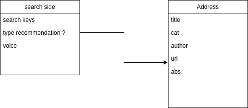

# arXiv search Engine 

## Get start

### Host Websit locally

#### 1. create **Virtual Enviroment** (suggested)

The code is based on [Django](https://www.djangoproject.com/), tested on Python 3.9.0+

**bash**

```shell
python3.9 -m venv venv
source venv/bin/activate
```

**csh**

```shell
python3.9 -m venv venv
source venv/bin/activate.csh
```

#### 2. install the required package

```shell
pip install requirements.txt
```

#### 3. start the server 

```shell

python manage.py runserver
```

## contribute

## UI design

### Home Page


### search page 


### data flow



## dev plan

### 1. front end

- [x] homepage UI
- [ ] send post-request
- [ ] display the search result

---
**Optional**

- [ ] Voice to Text (record and convert)
- [ ] type suggestions
- [ ] today's new papers

### 2. backend

- [ ] respond the request
- [ ] rank the paper according to its search score

---

**Optional**

- [ ] voice to text
- [ ] type suggestion and correction
- [ ] push suggested readings
- [ ] 

## Q&A

* if port 8000 is in use
  
```bash
sudo kill -9 `sudo lsof -t -i:8000`
```